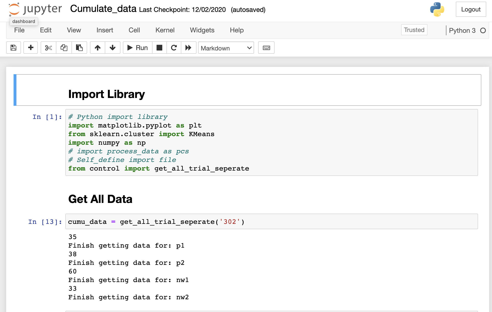
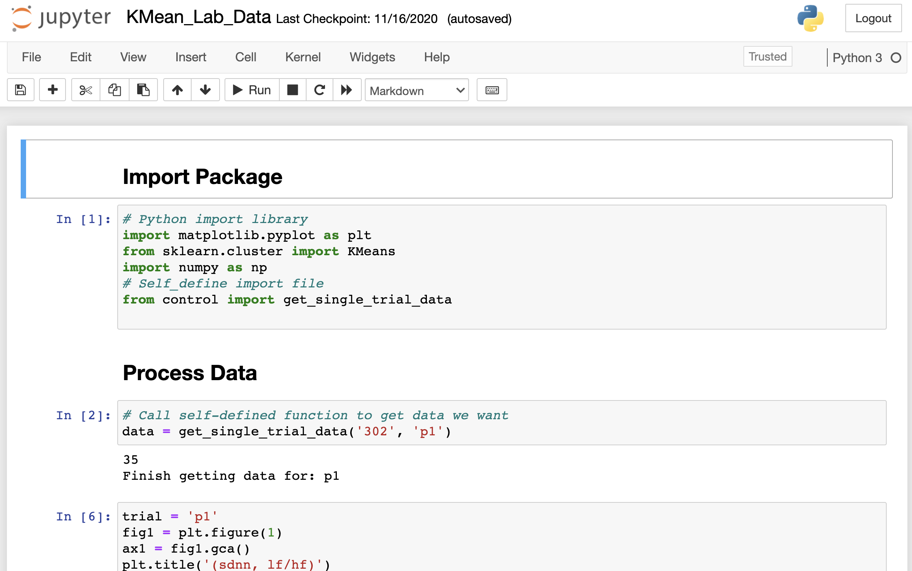

# HDCL
<!-- TABLE OF CONTENTS -->
<details open="open">
  <summary><h2 style="display: inline-block">Table of Contents</h2></summary>
  <ol>
    <li>
      <a href="#about-the-project">About The Project</a>
      <ul>
        <li><a href="#built-with">Built With</a></li>
      </ul>
    </li>
    <li>
      <a href="#getting-started">Getting Started</a>
      <ul>
        <li><a href="#prerequisites">Prerequisites</a></li>
        <li><a href="#installation">Installation</a></li>
      </ul>
    </li>
    <li><a href="#project-structure">Project Structure</a></li>
    <li><a href="#usage">Usage</a></li>
  </ol>
</details>


<!-- ABOUT THE PROJECT -->
## About The Project
- The ultimate goal of this project is to identify minimal sensor suite for anxiety detection
- Use K-means clustering to label data

### Built With
* Python
* Jupyter Notebook

<!-- GETTING STARTED -->
## Getting Started

### Prerequisites

- **Python** Please use Python 3.7-3.7.6 for this project (any python version between 3.6-3.7.9 might work too)
- **Jupyter Notebool** https://jupyter.org/install

### Installation

1. Clone the repo
   ```sh
   git clone https://github.com/TongyunHuang/HDCL.git
   ```
2. Due to github memory limit, I am not able to upload csv files, please add csv file under directory `/csv`. More information about Project Structure
    - Now support file `OA_2019_302_NW1_Rep_1.2.csv`, `OA_2019_302_NW2_Rep_1.5.csv`,
    `OA_2019_302_P1_Rep_1.3.csv`, 
    `OA_2019_302_P2_Rep_1.4.csv`

## Project Structure
```
.
├── 302_p1_EMG_datamatlab.mat
├── README.md                   <-- This file
├── Treadmill\ data_trial1-4    <-- Put Treadmill data here
│   ├── OA_302_TM_N1.csv        <-- *Please add this manually*
│   ├── OA_302_TM_N2.csv        <-- *Please add this manually*
│   ├── OA_302_TM_P1.csv        <-- *Please add this manually*
│   └── OA_302_TM_P2.csv        <-- *Please add this manually*
├── csv                         <-- Put csv file here
│   ├── OA_2019_302_NW1_Rep_1.2.csv   <-- *Please add this manually*
│   ├── OA_2019_302_NW2_Rep_1.5.csv   <-- *Please add this manually*
│   ├── OA_2019_302_P1_Rep_1.3.csv    <-- *Please add this manually*
│   ├── OA_2019_302_P2_Rep_1.4.csv    <-- *Please add this manually*
├── fNIRS
│   └── OA_FNIRS_2019_WALK_306_oxydata.txt
├── model                       <-- Most codes here
│   ├── Cumulate_data.ipynb     <-- Clustering 4 trials and visualization
│   ├── ECG_feature_extractor_1000.py  <-- Old code to read ECG
│   ├── KMean_Lab_Data.ipynb    <-- Clustering individual trial
│   ├── control.py              <-- BackEnd code to extract trial info
│   ├── process_data.py         <-- BackEnd code to read csv info
│   ├── utils.py                <-- Old code, include function used in process_data.py
│   └── view.py
├── python_dump_tomatlab.mat
```

<!-- USAGE EXAMPLES -->
## Usage
- If you want to cluster all four trials, open `Cumulate_data.ipynb`


- Otherwise, you want to cluster individual trials, open `KMean_Lab_Data.ipynb`. You can sepcify which trial to cluster in the second block.

